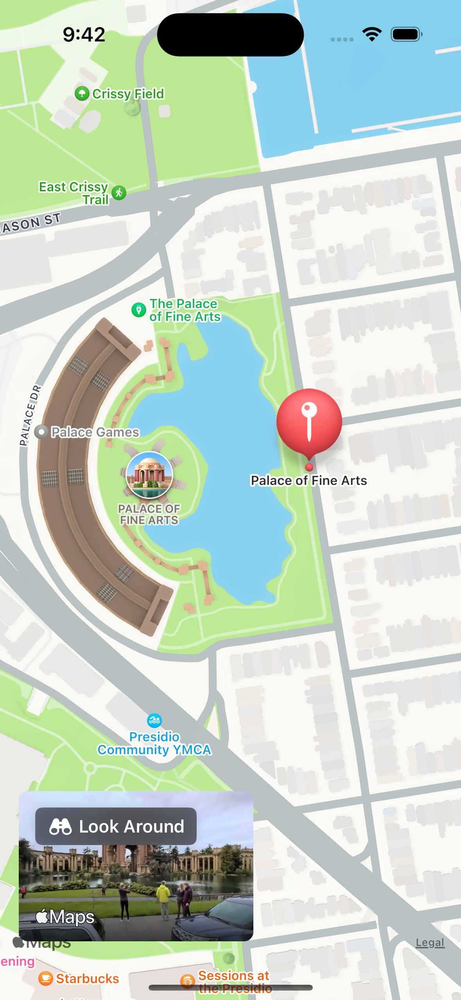
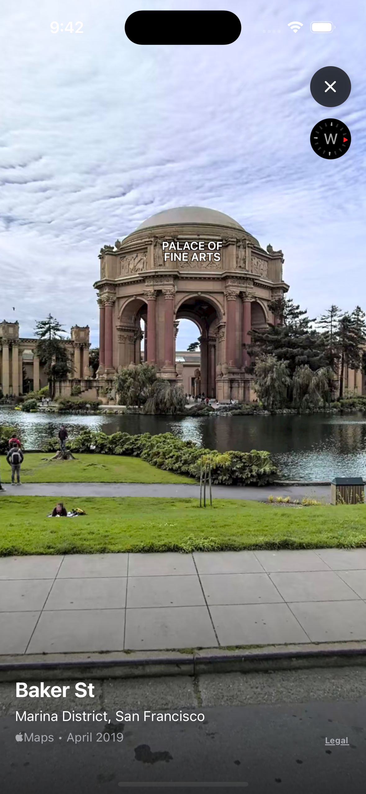

# Look Around Scene in SwiftUI

Welcome to the Look Around Scene View in SwiftUI sample project! This project demonstrates how to create an immersive street view experience similar to Google Maps' Street View, using SwiftUI and Apple's Look Around feature in MapKit. Users can drop pins on the map to mark specific locations and then explore a 360-degree panoramic view of those locations.

## Screenshots





## Getting Started

### Prerequisites

- Xcode 14.0+
- iOS 16.0+
- Swift 5.0+

## Running the Project

To run the project locally, follow these steps:

1. Clone the repository: 

```
git clone https://github.com/pansuriyaravi/Look-Around.git
```

2. Open the project in Xcode:

```
open Look Around.xcodeproj
```

3. Build and run the project using Xcode's simulator.

## Contact

If you have any questions or need further clarification, please feel free to reach out to me. You can contact me at hi.ravipansuriya@icloud.com.
   
